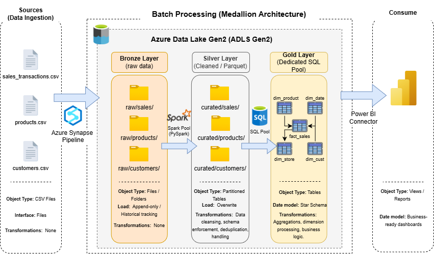

# 🛒 RetailPulse — Azure Data Engineering Project

>A end-to-end data engineering pipeline built on **Microsoft Azure**, processing retail sales data through a full Medallion Architecture: from raw ingestion to a star-schema data warehouse and real-time IoT streaming.

[](LICENSE)
[](#)
[](#)
[](#)
---

## 📋 Table of Contents

- [Architecture Overview](#Architecture_Overview)
- [Datasets](#Datasets)
- [Data Lake Folder Structure](#Data_Lake_Folder_Structure)
- [Star Schema](#Star_Schema)
- [Repository Structure](#Repository_Structure)
- [Azure Resources](#Azure_Resources)
- [Prerequisites](#Prerequisites)
- [Expected Results](#Expected_Results)
- [License](#License)
- [Contact](#Contact)

---

## 📐 Architecture Overview



---

## 🗂️ Datasets

| Dataset | File | Rows | Description |
|---|---|---|---|
| Sales Transactions | `sales_transactions.csv` | ~500,000 | Daily POS transactions across 50 stores |
| Product Catalog | `products.csv` | 500 | Products with category, sub-category, supplier |
| Customer Profiles | `customers.csv` | 50,000 | Customer demographics and loyalty tier |

---

## 🏗️ Data Lake Folder Structure

```
retaildata/                          # ADLS Gen2 Container
│
├── raw/                             # Bronze Layer (raw)
│   ├── sales/
│   │   └── sales_transactions.csv
│   ├── products/
│   │   └── products.csv
│   ├── customers/
│   │   └── customers.csv
│   └── error_logs/                  # Pipeline fault tolerance logs
│
├── curated/                         # Silver Layer (cleaned Parquet)
│   ├── sales/
│   │   └── year=2023/
│   │       ├── month=1/
│   │       ├── month=2/
│   │       └── ... month=12/
│   ├── products/
│   │   └── *.parquet
│   └── customers/
│       └── *.parquet
│
└── warehouse/                       # Gold Layer (Dedicated SQL Pool)

```

---

## 📦 Star Schema (Data Warehouse)


| Table | Type | Distribution | Rows |
|---|---|---|---|
| `fact_sales` | Fact | HASH(customer_key) | ~500,000 |
| `dim_date` | Dimension | REPLICATE | 365 |
| `dim_product` | Dimension | REPLICATE | 500 |
| `dim_customer` | Dimension | HASH(customer_id) | 50,000 |
| `dim_store` | Dimension | REPLICATE | 50 |

---

## 🗃️ Repository Structure

```
end-to-end-azure-data-engineering-project/
├── docs/
│   └──architecture_diagram.drawio.png
│
├── datasets/
│   ├── sales_transactions.csv
│   ├── products.csv
│   └── customers.csv
│
├── notebooks/                   ← Synapse Spark notebooks
│   ├── nb_bronze_to_silver_sales.ipynb
│   ├── nb_bronze_to_silver_products.ipynb
│   └── nb_bronze_to_silver_customers.ipynb
│
├── sql/                         ← SQL scripts
│   ├── create_star_schema.sql
│   ├── load_dimensions.sql
│   ├── load_fact_sales.sql
│   ├── analytical_queries.sql
│   └── serverless_queries.sql
│
└── README.md
```

---

## ⚙️ Azure Resources

| Resource | Name Pattern | Purpose |
|---|---|---|
| Resource Group | `rg-retailpulse-<initials>` | Container for all resources |
| Storage Account | `adlsretailpulse<initials>` | ADLS Gen2 Data Lake |
| Synapse Workspace | `synapse-retailpulse-<initials>` | Pipelines, Spark, SQL |
| Spark Pool | `spark-retailpulse` | PySpark batch processing |
| Dedicated SQL Pool | `sqlpool_retailpulse` | Data warehouse (DW100c) |

---

## 🛠️ Prerequisites

- Azure subscription 
- Power BI Desktop 

---

## 📊 Expected Results

| Query | Expected Output |
|---|---|
| Revenue by Region | Cairo leads, followed by Alexandria |
| Monthly Revenue Trend | 12 rows; December typically highest |
| Top Category Revenue | Electronics and Grocery lead |
| Loyalty Tier Revenue | Platinum highest avg spend |

---

## 📄 License

This project is licensed under the **MIT License** — see the [LICENSE](LICENSE) file for details.

---

## 📬 Contact

|                  | Contact                              |
|------------------|--------------------------------------|
| LinkedIn         | [Abanob Melk](https://www.linkedin.com/in/abanob-melk/) |
| Email            | AbanobAshraf220@gmail.com            |

---

<p align="center">
  Built with ❤️ by Abanob Ashraf
</p>
